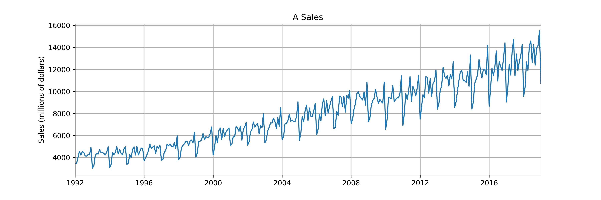

# Sales_Forecasting_RNN

## Description
This project was given in the neural network course to help students better understand time series prediction and get hands-on experience in building recurring neural networks for a particular dataset. The dataset consists of a market's sales amount from 1992 to 2020, and the task was to predict the sales pattern in the last 12 months (during 2019) given the previous records (1992 to 2019) as training data.

## Implementation

### Pre-processing
Before constructing models, it needs to fully prepare the dataset, so as the first step, fields with null and nan values were removed. Then, the train test split step was done and information from the last 12 months was separated from the rest of the data and considered as test data. Moreover, as an important step to make learning models converge better, data is normalized by the min-max scaler method. 

### Model Definition
Generally, recurrent neural networks (RNNs) are one of the most effective methods when it comes to serial data. Gated Recurrent Units (GRU) are one types of RNN that help us to get rid of the [short-term memory problem]([https://www.google.com](https://medium.com/analytics-vidhya/undestanding-recurrent-neural-network-rnn-and-long-short-term-memory-lstm-30bc1221e80d)) which causes the model to forget earlier information it learned. In fact, it employs "gates" which determine what information in a sequence is beneficial to learn and keep enabling to pass essential information even in long series. Therefore, in order to tackle this problem, a GRU model with a GRU layer and a fully-connected layer was defined. This model was then trained for 20 epochs with the Adam optimizer. Finally, the model's predictions for the last 12 months are denormalized to be in the same scale as the labels and plotted.
